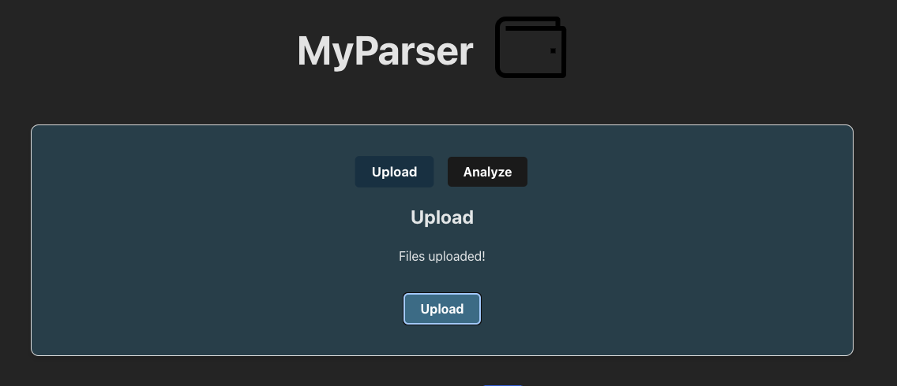
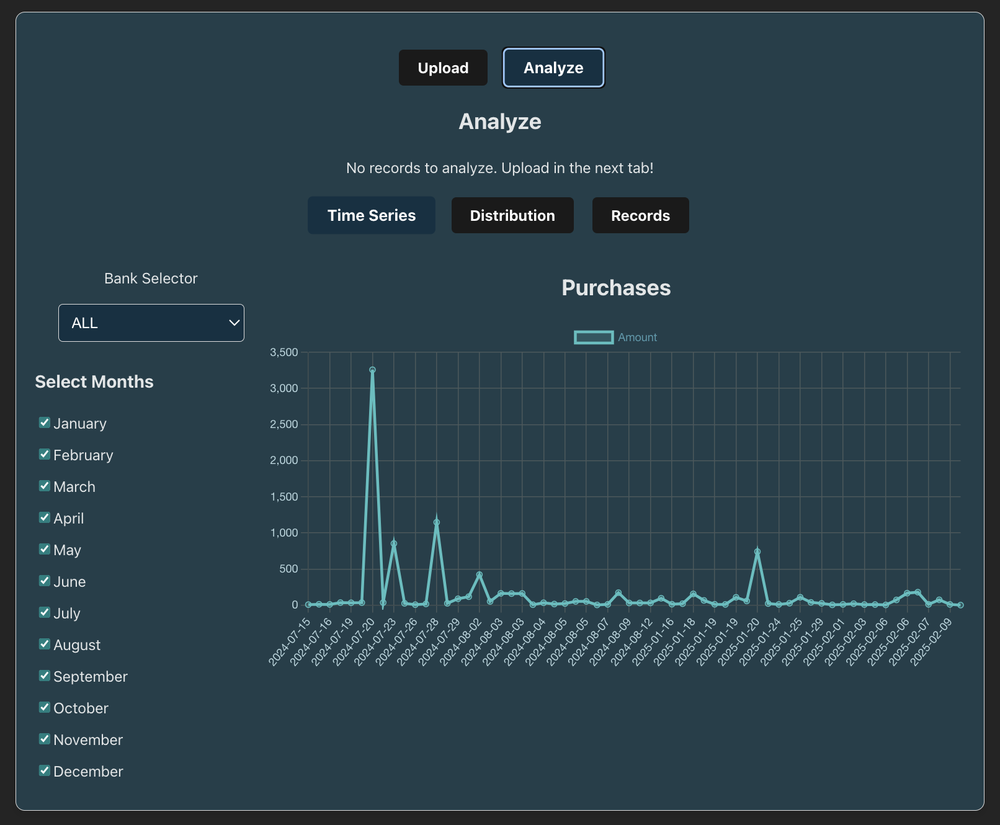
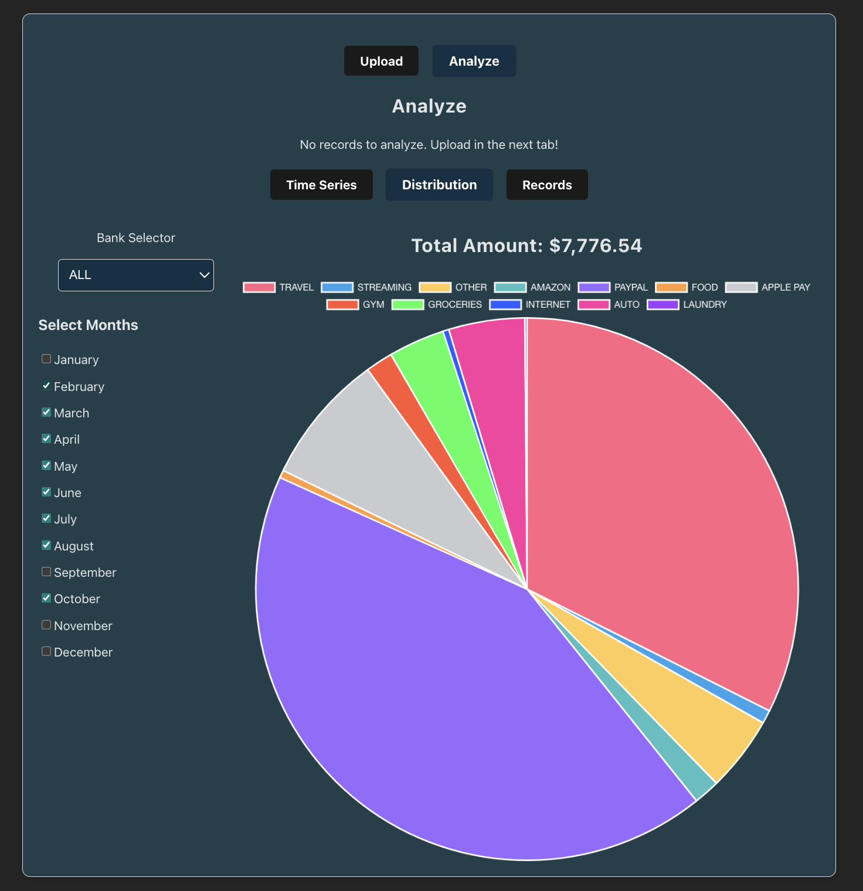
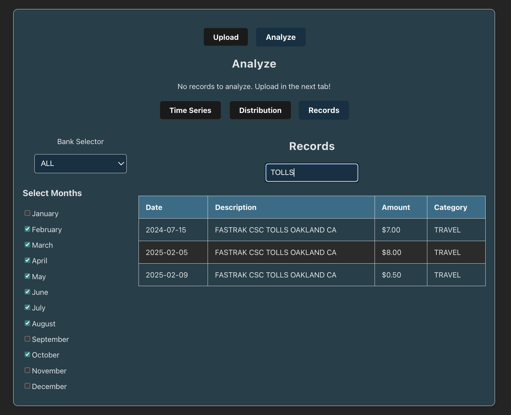

<div align="center">
    
</div>

## Overview
This is a full-stack financial management application built using PostgreSQL, FastAPI, and a modern web frontend. The application runs in Docker containers for easy deployment and development.

<div align="center">
    
</div>

## Analysis

Look at your statement records in a time series or a pie chart and toggle the months and categories. You can also search your records for keywords in the the description.

<div style="display: flex; justify-content: center; align-items: center; gap: 20px;">
    
    
    
</div>

## Prerequisites
- Docker
- Docker Compose
- Bash shell
- sudo privileges

## Quick Start
1. Clone the repository
2. Create a `.env` file with required environment variables
3. Run the application:
```bash
./run.bash
```

For development mode:
```bash
./run.bash --dev
```

## Components
- **Database**: PostgreSQL container for data storage
- **Backend**: FastAPI application
- **Frontend**: React Web application (runs on port 5173)

## Script Options
```bash
Usage: ./run.bash [OPTIONS]

Options:
    -h, --help    Show this help message
    --dev         Use docker-compose.dev.yml configuration
    --down        Stop and remove containers
```

## Features
- Automatic database backup before teardown
- Development mode with hot-reloading
- PostgreSQL logging configuration
- Containerized environment

## Directory Structure
```
.
├── backups/          # Database backups
├── logs/            # Application logs
├── sql/             # SQL initialization files
├── webapp/          # Frontend application
└── docker-compose.yml
```

## Environment Variables
Required environment variables:
- `DB_USER`
- `DB_PASSWORD`
- `DB_NAME`
- `DB_PORT`
- `SERVER_PORT`
- `FRONTEND_PORT`
- `API_URL`

Example

```bash
DB_NAME=finance
DB_USER=user
DB_PASSWORD=1234
DB_PORT=5432
SERVER_PORT=8000
API_URL=http://localhost
FRONTEND_PORT=5173
```
