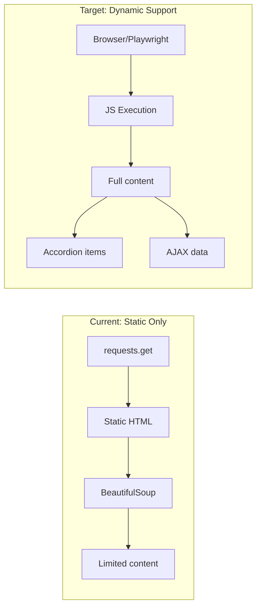
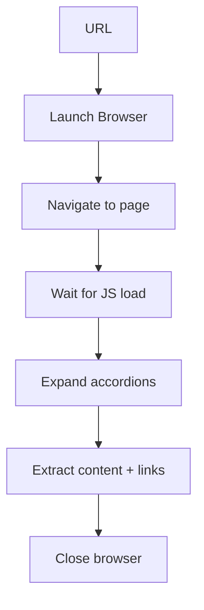
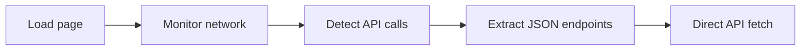
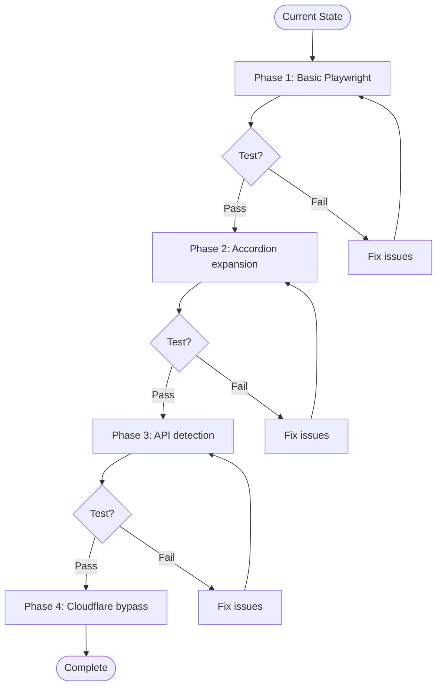

# Crawler Improvements

Current crawler limitations and solutions for handling dynamic/JS-rendered content.

## Current State vs Target



## Limitations

### Cannot extract:
- JS-loaded content
- AJAX/fetch responses
- Collapsed accordion content
- Dynamically generated DOM
- SPA route changes
- Content behind Cloudflare

### Why:
- `requests` fetches static HTML only
- No JS execution
- Aggressive element removal (nav, script, etc.)
- No wait for dynamic loading

## Solutions

### 1. Playwright Integration (Recommended)

Replace static fetch with browser automation.



**Implementation:**

```python
from playwright.sync_api import sync_playwright, TimeoutError as PlaywrightTimeout

class PlaywrightCrawler:
    def __init__(self, config: CrawlerConfig):
        self.config = config
        self.rate_limiter = RateLimiter(delay=config.delay)
    
    def _fetch_page_with_js(self, url: str, base_url: str) -> Dict[str, Any]:
        """Fetch page with JS execution."""
        with sync_playwright() as p:
            # Launch browser (headless)
            browser = p.chromium.launch(headless=True)
            context = browser.new_context(
                user_agent=self.config.user_agent,
                viewport={'width': 1920, 'height': 1080}
            )
            page = context.new_page()
            
            try:
                # Navigate and wait for content
                page.goto(url, wait_until='networkidle', timeout=30000)
                
                # Wait for dynamic content
                page.wait_for_timeout(2000)
                
                # Expand accordions/collapsible elements
                accordions = page.query_selector_all('[data-toggle="collapse"], .accordion-button')
                for acc in accordions:
                    try:
                        acc.click()
                        page.wait_for_timeout(500)
                    except:
                        pass
                
                # Extract content
                content = page.inner_text('body')
                
                # Extract links
                links = []
                for link in page.query_selector_all('a[href]'):
                    href = link.get_attribute('href')
                    if href:
                        absolute = page.evaluate(f'new URL("{href}", "{url}").href')
                        normalized = normalize_url(absolute)
                        if should_crawl_url(normalized, base_url):
                            links.append(normalized)
                
                browser.close()
                return {'url': url, 'content': content, 'links': links, 'ok': True}
                
            except Exception as e:
                browser.close()
                return {'url': url, 'content': '', 'links': [], 'ok': False, 'err': str(e)}
```

**Install:**

```bash
pip install playwright
playwright install chromium
```

### 2. API Endpoint Detection

Intercept network requests to find data sources.



**Implementation:**

```python
def _intercept_api_calls(self, url: str) -> List[str]:
    """Capture API endpoints from network traffic."""
    api_endpoints = []
    
    with sync_playwright() as p:
        browser = p.chromium.launch(headless=True)
        page = browser.new_page()
        
        # Listen for API calls
        def handle_route(route):
            request = route.request
            if 'api' in request.url or 'json' in request.url:
                api_endpoints.append(request.url)
            route.continue_()
        
        page.route('**/*', handle_route)
        page.goto(url, wait_until='networkidle')
        page.wait_for_timeout(3000)
        
        browser.close()
    
    return api_endpoints
```

### 3. Embedded JSON Extraction

Parse script tags for embedded data.

```python
def _extract_embedded_json(self, soup: BeautifulSoup) -> List[Dict]:
    """Extract JSON from script tags."""
    events = []
    
    for script in soup.find_all('script', type='application/ld+json'):
        try:
            data = json.loads(script.string)
            if data.get('@type') in ['Event', 'EventSeries']:
                events.append(data)
        except:
            pass
    
    # Also check for window.APP_DATA patterns
    for script in soup.find_all('script'):
        if script.string and 'var events = ' in script.string:
            # Extract JS variable assignment
            match = re.search(r'var events = ({.*?});', script.string)
            if match:
                try:
                    events.append(json.loads(match.group(1)))
                except:
                    pass
    
    return events
```

### 4. Selective Element Removal

Keep nav elements, selectively remove only noise.

**Current (line 108):**
```python
for el in soup(["script", "style", "nav", "header", "footer", "aside", ...]):
    el.decompose()
```

**Improved:**
```python
# Remove only true noise, keep nav/header for links
for el in soup.select('style, iframe, noscript, svg'):
    el.decompose()

# Remove only non-content scripts (tracking, ads)
for script in soup.find_all('script'):
    src = script.get('src', '')
    if any(x in src for x in ['analytics', 'gtm', 'facebook', 'twitter']):
        script.decompose()
```

### 5. Cloudflare Bypass

Use undetected-chromedriver or stealth settings.

```python
from playwright.sync_api import sync_playwright

def _launch_stealth_browser(self):
    """Launch browser with anti-detection."""
    with sync_playwright() as p:
        browser = p.chromium.launch(
            headless=False,  # Cloudflare detects headless
            args=[
                '--disable-blink-features=AutomationControlled',
                '--disable-dev-shm-usage',
            ]
        )
        context = browser.new_context(
            user_agent='Mozilla/5.0 (Macintosh; Intel Mac OS X 10_15_7)',
            viewport={'width': 1920, 'height': 1080},
            extra_http_headers={
                'Accept-Language': 'en-US,en;q=0.9',
            }
        )
        # Mask automation
        context.add_init_script("""
            Object.defineProperty(navigator, 'webdriver', {
                get: () => undefined
            });
        """)
        return browser, context
```

## Implementation Roadmap



### Phase 1: Basic Playwright (MVP)
- Install Playwright
- Replace `_fetch_page` with `_fetch_page_with_js`
- Test with sandiego.org
- Verify increased link extraction

### Phase 2: Accordion Support
- Detect accordion patterns
- Auto-click to expand
- Wait for content load
- Extract expanded links

### Phase 3: API Detection
- Monitor network traffic
- Capture JSON endpoints
- Direct API fetching when available
- Fallback to page scraping

### Phase 4: Anti-Detection
- Stealth browser config
- Cloudflare bypass
- Rate limiting
- Session management

## Configuration Changes

Add to `CrawlerConfig`:

```python
class CrawlerConfig(BaseModel):
    # Existing fields...
    
    # New fields for JS support
    use_playwright: bool = Field(default=False, description="Use browser automation")
    wait_for_js: int = Field(default=2000, description="Wait time for JS (ms)")
    expand_accordions: bool = Field(default=True, description="Auto-expand accordions")
    intercept_apis: bool = Field(default=False, description="Capture API endpoints")
    stealth_mode: bool = Field(default=False, description="Anti-detection measures")
    headless: bool = Field(default=True, description="Run browser headless")
```

## Testing

```bash
# Test basic Playwright
python crawl.py --url "https://www.sandiego.org/events-festivals" \\
  --use-playwright --depth 2

# Test with accordion expansion
python crawl.py --url "https://example.com/events" \\
  --use-playwright --expand-accordions

# Test API interception
python crawl.py --url "https://example.com/calendar" \\
  --use-playwright --intercept-apis --verbose
```

## Performance Comparison

| Method | Speed | Content Coverage | JS Support | Cloudflare |
|--------|-------|------------------|------------|------------|
| requests | Fast | 20-40% | No | No |
| Playwright | Slower | 90-100% | Yes | With stealth |
| API Direct | Fastest | 100% | N/A | Sometimes |

## #ICONS

- [>] Start
- [+] Success
- [-] Error
- [!] Warning
- [i] Info

## References

- [Playwright Python](https://playwright.dev/python/docs/intro)
- [Anti-detection patterns](https://github.com/ultrafunkamsterdam/undetected-chromedriver)
- [Cloudflare bypass techniques](https://github.com/VeNoMouS/cloudscraper)
