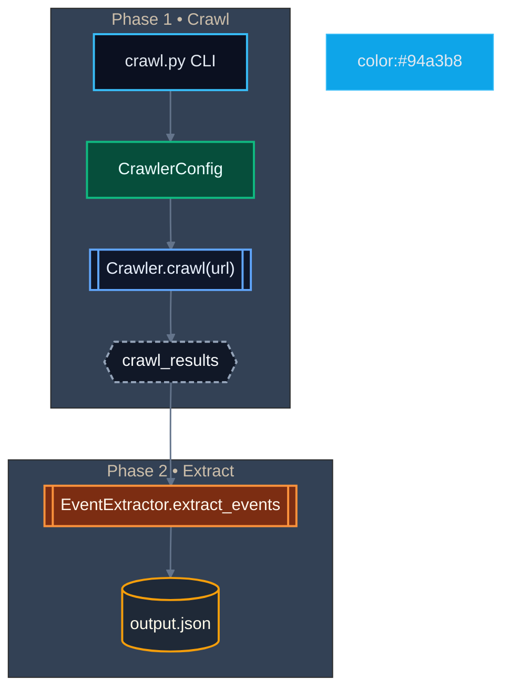
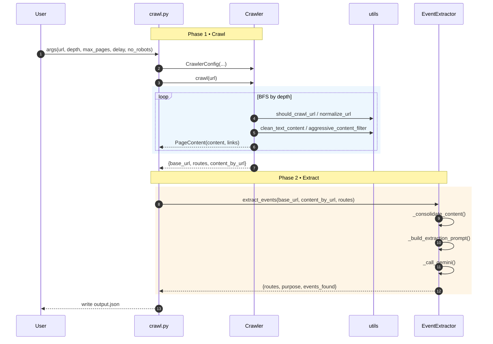

# Event Discovery Web Crawler (architecture-first)

Purpose: discover events/activities from a single site using a two-phase flow. Focus on minimal AI calls, deterministic crawl, structured JSON output.

Entry point: crawl.py (CLI)

## Flow (high level)



## Components used by crawl.py

- crawl.py (embedded Crawler/CrawlerConfig)
- CrawlerConfig: max_depth, max_pages, delay, timeout, user_agent, respect_robots, max_content_chars
- Crawler
    - crawl(start_url): breadth-first crawl within domain; prioritizes event-like links; returns
      - base_url
      - base_content
      - routes (list of URLs)
      - content_by_url {url -> cleaned text}
      - total_pages, depth_reached
- _fetch_page(url, base_url): request + parse + clean + link extract
- event_extractor.py
  - EventExtractor
    - extract_events(base_url, content_by_url, routes): single Gemini call
    - _consolidate_content(): concatenate per-URL text with limits
    - _build_extraction_prompt(): strict JSON schema for routes/purpose/events
    - _call_gemini(): new SDK if available, else legacy
- utils.py (subset used)
  - is_valid_url, normalize_url, should_crawl_url
  - clean_text_content, aggressive_content_filter
- RateLimiter

Notes
- ignore console/formatting and logging utilities in this doc

## Data contracts

crawl_results (from Crawler.crawl)
- base_url: str
- base_content: str
- routes: list[str]
- content_by_url: dict[str,str]
- total_pages: int
- depth_reached: int

event_results (from EventExtractor.extract_events)
- base_url: str
- routes: list[str] (event-related only)
- purpose: str
- events_found: list[{title, description, date, start_time, end_time, address, source_url}]

Output file
- JSON keyed by base_url: { base_url: { routes, purpose, events_found } }

## CLI (minimal)

```bash
python crawl.py --url "https://example.com" --depth 2 --max-pages 50 --output output.json
# optional: --delay 1.0 --verbose/--quiet
```

## Programmatic usage (optional)

```python
from crawl import Crawler, CrawlerConfig
from event_extractor import EventExtractor

cfg = CrawlerConfig(max_depth=2, max_pages=50, delay=1.0)
crawler = Crawler(cfg)
res = crawler.crawl("https://example.com")

extractor = EventExtractor()
events = extractor.extract_events(
    base_url=res["base_url"],
    content_by_url=res["content_by_url"],
    routes=res["routes"],
)

# Save structure mirrors CLI output
out = { events.get("base_url", "unknown"): {
    "routes": events.get("routes", []),
    "purpose": events.get("purpose", ""),
    "events_found": events.get("events_found", []),
}}
```

## Mermaid (detailed interactions)



## File map

Used by crawl.py
- crawl.py: CLI + embedded Crawler/CrawlerConfig (crawl + save)
- event_extractor.py: single-call event extraction
- utils.py: URL/text helpers, rate limiting

## #ICONS

- [>] start/info
- [+] success
- [-] error
- [!] warning
- [i] info
- [*] event marker


