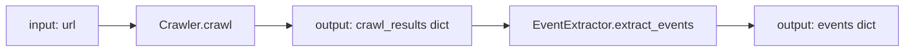
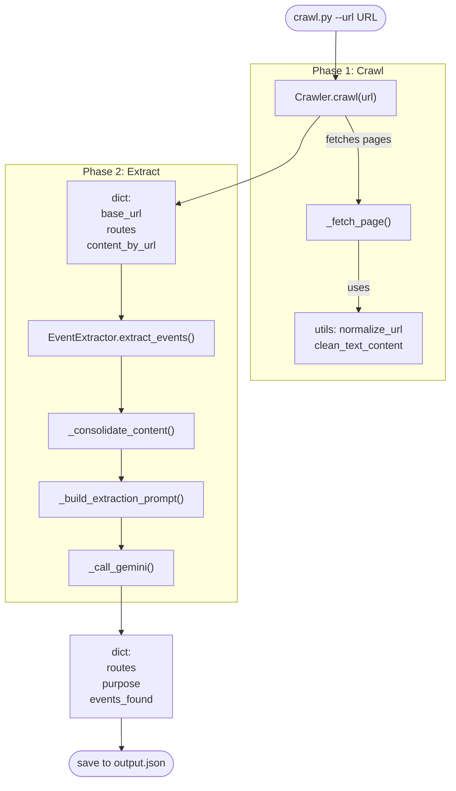

# Event Discovery Web Crawler (architecture-first)

Purpose: discover events/activities from a single site using a two-phase flow. Focus on minimal AI calls, deterministic crawl, structured JSON output.

Entry point: crawl.py (CLI)

## Flow (high level)



## Components used by crawl.py

- crawl.py (embedded Crawler/CrawlerConfig)
- CrawlerConfig: max_depth, max_pages, delay, timeout, user_agent, respect_robots, max_content_chars
- Crawler
    - crawl(start_url): breadth-first crawl within domain; prioritizes event-like links; returns
      - base_url
      - base_content
      - routes (list of URLs)
      - content_by_url {url -> cleaned text}
      - total_pages, depth_reached
- _fetch_page(url, base_url): request + parse + clean + link extract
- event_extractor.py
  - GeminiModel: Enum of model codes with input/output token limits (see [Gemini API docs](https://ai.google.dev/gemini-api/docs/models))
  - TokenTracker: Tracks token usage across API calls
    - track_request(prompt_tokens, completion_tokens): Record token usage
    - report(): Generate usage summary with totals, averages, utilization
  - EventExtractor (inherits TokenTracker)
    - extract_events(base_url, content_by_url, routes): single Gemini call with token tracking
    - _consolidate_content(): concatenate per-URL text with limits
    - _build_extraction_prompt(): strict JSON schema for routes/purpose/events
    - _call_gemini(): Google GenAI SDK (new) with token counting
- utils.py (subset used)
  - is_valid_url, normalize_url, should_crawl_url
  - clean_text_content, aggressive_content_filter
- RateLimiter

Notes
- Uses [Google GenAI SDK](https://ai.google.dev/gemini-api/docs/models) (new, not legacy)
- All legacy SDK code removed
- Token usage automatically tracked and reported in output

## Data contracts

crawl_results (from Crawler.crawl)
- base_url: str
- base_content: str
- routes: list[str]
- content_by_url: dict[str,str]
- total_pages: int
- depth_reached: int

event_results (from EventExtractor.extract_events)
- base_url: str
- routes: list[str] (event-related only)
- purpose: str
- events_found: list[{title, description, date, start_time, end_time, address, source_url}]
- token_usage: dict with model, total_requests, total_prompt_tokens, total_completion_tokens, total_tokens, avg_prompt_tokens, avg_completion_tokens, model_limits, utilization

Output file
- JSON keyed by base_url: { base_url: { routes, purpose, events_found, token_usage } }

## CLI (minimal)

```bash
python crawl.py --url "https://example.com" --depth 2 --max-pages 50 --output output.json
# optional: --delay 1.0 --verbose/--quiet
```

## Programmatic usage (optional)

```python
from crawl import Crawler, CrawlerConfig
from event_extractor import EventExtractor

cfg = CrawlerConfig(max_depth=2, max_pages=50, delay=1.0)
crawler = Crawler(cfg)
res = crawler.crawl("https://example.com")

extractor = EventExtractor()
events = extractor.extract_events(
    base_url=res["base_url"],
    content_by_url=res["content_by_url"],
    routes=res["routes"],
)

# Save structure mirrors CLI output
out = { events.get("base_url", "unknown"): {
    "routes": events.get("routes", []),
    "purpose": events.get("purpose", ""),
    "events_found": events.get("events_found", []),
}}
```

## Detailed flow



## File map

Used by crawl.py
- crawl.py: CLI + embedded Crawler/CrawlerConfig (crawl + save)
- event_extractor.py: single-call event extraction
- utils.py: URL/text helpers, rate limiting

## Limitations & Improvements

Current crawler uses static HTML fetching (requests + BeautifulSoup).

**Cannot extract:**
- JavaScript-loaded content
- Dynamically generated DOM elements
- Content in collapsed accordions
- Sites with Cloudflare protection

See [IMPROVE_CRAWL.md](IMPROVE_CRAWL.md) for detailed solutions including:
- Playwright integration for JS support
- API endpoint detection
- Cloudflare bypass techniques
- Implementation roadmap with code examples

## #ICONS

- [>] start/info
- [+] success
- [-] error
- [!] warning
- [i] info
- [*] event marker


